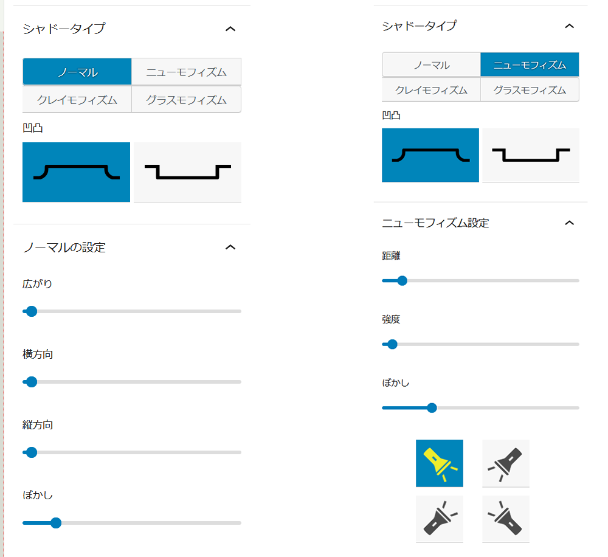
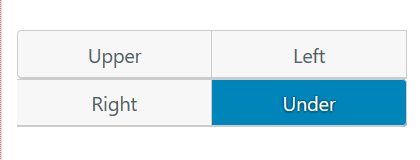
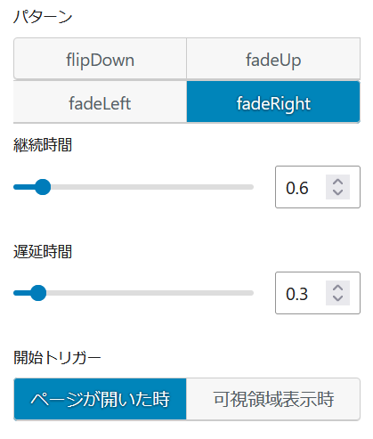
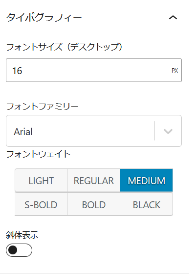
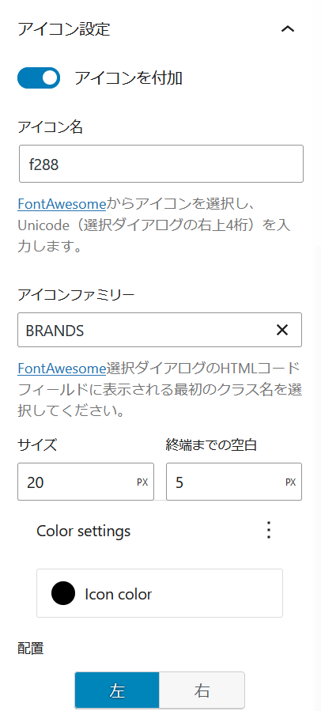
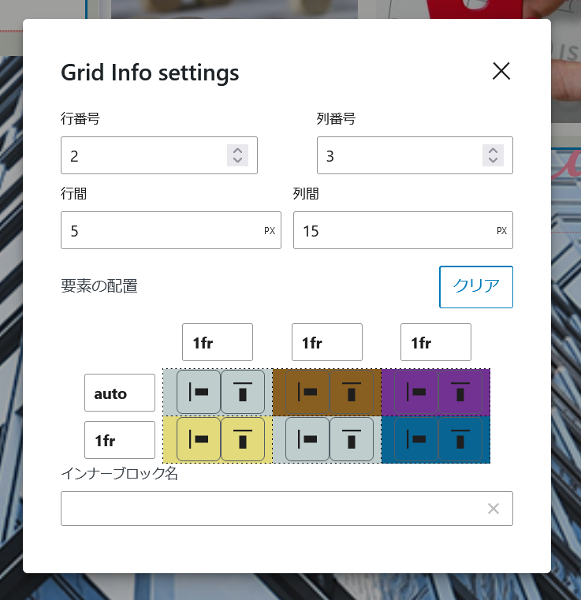
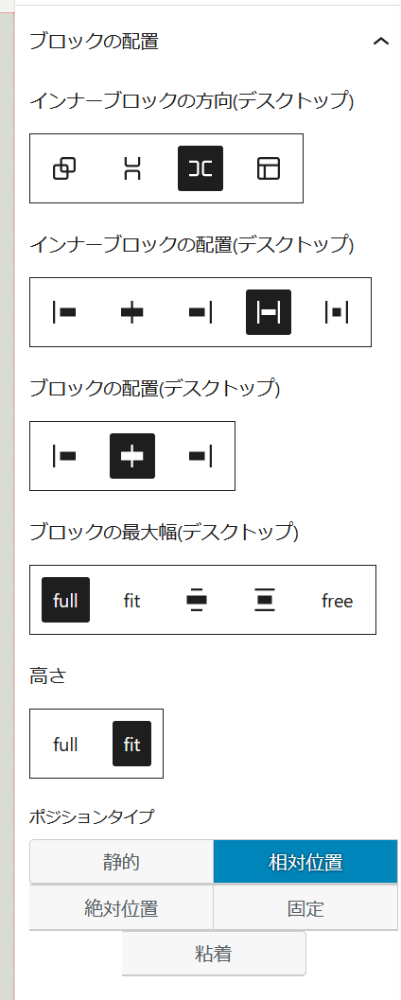

# 概要
WordPressのカスタムブロックを作成するためのプラグインで活用するパッケージです。複数のプラグインで共通に使用する機能をパッケージにまとめました。

# 使用方法
```
import {関数名又はコンポーネント名} from "itmar-block-packages"
```
名前付きインポートでお願いします。

## 必要条件

このパッケージは`@wordpress/scripts`によるWebPackのトランスパイル環境でトランスパイルされています。そして、このパッケージを使用するには、`@wordpress/scripts`のバージョン^27.6.0以上が必要です。以下のコマンドを実行して、`@wordpress/scripts`を更新してください：

npm i @wordpress/scripts@^27.6.0 --save-dev

## 更新履歴
= 1.3.19 =  
- FieldChoiceControlの選択可能フィールドにlinkを加えて、個別投稿ページへのリンク設定を可能にした。
- BlockPlaceのフレックスボックスの配置に交差軸の配置を加えた。
- TermChoiceControlでタームの表示をするか否かの選択を設定できるようにした。

= 1.3.18 =  
- WordPress RestAPIのエンドポイントを文字列で受けて、その結果を返すrestFetchDataを新設
- TermChoiceControlでonChangeコールバックで返す引数にterm.nameを加えた。
- BlockPlaceコンポーネントのフレックススタイルに折り返しを設定できるように機能追加
- BlockPlaceコンポーネント内のブロック幅とブロック高の設定をBlockWidthとBlockHeightの各コンポーネントを利用するように変更
- BlockWidthに幅と最大幅を別々に設定できるように機能追加
- BlockPlaceコンポーネント内の横方向ブロック配置をフレックス、グリッドスタイルでも設定できるように修正  

= 1.3.17 =  
- restFieldesをインポートするため、エクスポート項目に加えた。

= 1.3.16 =  
- インスペクターの表示の国際化されていない部分を国際化した。

= 1.3.15 =  
- BlockPlaceのプロプスに視差効果のフラグを与え、そのフラグがtrueの時は中央揃えのセットができないように制御するようにした

= 1.3.14 =  
- position_prmの中央揃えがセットされていない場合にnullが出力されるという不具合を修正

= 1.3.13 =  
- BlockWidthのラベル表示が誤っていたのを修正

= 1.3.12 =  
- BlockPlaceの配置タイプが絶対位置の場合に縦横の中央揃えが設定できる機能を追加
- 中央揃えができるようにしたために、position_prmにそれに対応するCSSプロパティを返す機能を追加

= 1.3.11 =  
- BlockPlace、BlockWidth、BlockHeightのfreeサイズにpx以外の単位を設定できるように修正
- freeサイズにpx以外の単位を設定できるようにしたことから、max_width_prm、width_prm、height_prmがそれに対応できるように修正

= 1.3.10 =  
- useDuplicateBlockRemoveの不具合を修正。
- ブロックの幅、高さを設定するためのコンポーネントとしてBlockWidth、BlockHeightを追加

= 1.3.9 =  
- カスタムフックとしてuseDuplicateBlockRemoveを追加。このフックはインナーブロックが挿入されたとき、指定されたブロック名が存在れば、挿入されたブロックを削除する。

= 1.3.8 =  
- WordPressのデータをRest APIを通して取得する関数等のFieldChoiceControlの機能として、choiceFieldsに登録されるフィールド名がmetaによるカスタムフィールドかacfによるカスタムフィールドかを峻別できるようにフィールド名にmeta_又はacf_という接頭辞を付加するようにした。
- カスタムフックとしてuseBlockAttributeChangesを追加。このフックはitmar/design-group内のブロックで、指定のブロック名とクラス名のブロックの属性に変化があったとき、その変化の内容を通知する機能をもつ。同一のブロック名とクラス名をもつブロックに対して、変化した属性を自動的に設定する機能もある。

= 1.3.4 =  
- BlockPlaceコンポーネントの高さにフリーサイズを追加し、デスクトップとモバイルでそれぞれ設定を可能うにした。それに伴ってcssPropertesのheight_prmのシグニチャーを変更。

= 1.3.2 =  
- BlockPlaceコンポーネントのインナーブロックの方向で縦方向又は横方向を選択したとき反転の設定ができるようにした。

= 1.3.1 =  
- edit.scssおよびstyle.scssの共通スタイルについては機能しないことが判明したので削除した。

= 1.3.0 =  
- WordPressのデータをRest APIを通して取得する関数等に、次の関数とReactコンポーネントを追加した
 - restTaxonomies
 - TermChoiceControl
- edit.scssおよびstyle.scssを配置し、これをトランスパイルして、複数のプラグインから共通のスタイルとして使用できるようにした


# 各コンポーネント・関数の機能
## カスタムフック
### useIsIframeMobile
WordPressのエディタ（ブロックエディタ、サイトエディタ）の大きさを監視し、幅が767ピクセル以下であればtrueを返します。
```
const is_mobile=useIsIframeMobile();
```

### useElementBackgroundColor
ブロックの背景色を返します。ユーザー設定で指定されていれば、その色を返し、指定されていないか、カスタムプロパティ（--wpで始まるプロパティ）であれば、getComputedStyleで実際にレンダリングされた色を取得します。
#### 引数
- `blockRef`  
ブロックへの参照。useRefで取得
- `style`  
ブロックに設定されているスタイル。useBlockPropsで取得
```
//ブロックの参照
const blockRef = useRef(null);
//blockPropsの参照
const blockProps = useBlockProps({
	ref: blockRef, // ここで参照を blockProps に渡しています
});

//背景色の取得
const baseColor = useElementBackgroundColor(blockRef, blockProps.style);
```

### useElementWidth

### useIsMobile
ViewPortの大きさの大きさを監視し、幅が767ピクセル以下であればtrueを返します。
```
const is_mobile=useIsMobile();
```
### useDeepCompareEffect
たくさんの要素をもつオブジェクトや配列の内容の変化で発火するuseEffect
#### 引数
- `callback` func  
発火させたい関数
- `dependencies` array  
依存変数にしたい配列
```
useDeepCompareEffect(() => {
・・・
},
[attributes])

```
### useFontawesomeIframe
iframeにfontawesomeを読み込むカスタムフック

### useBlockAttributeChanges
特定のブロックの属性が変更されたとき、その変更内容を返すカスタムフック。引数に指定されたブロック名のブロックで指定されたクラス名をもつブロックの属性の変更内容を返す。第3引数のフラグにtrueを指定すると同じブロック名で同じクラス名をもつブロックの属性を変更されたブロックの属性で自動的に更新する。ただし、変更内容については、指定された属性名の属性を変更及び比較の対象からはずすことができる。  

#### 引数
- `clientId` string  
変更されたことを監視する範囲となるitmar/design-groupブロックのclientId
- `blockName` string  
変更の監視対象となるブロック名
- `className` string  
変更の監視対象となるブロックが有するクラス名
- `modFlg` boolean  
同種ブロックを更新するかどうかのフラグ。デフォルトはfalse
- `excludeAttributes` object  
自動更新の対象から除外する属性をオブジェクトで指定する。オブジェクトは属性名をキーとし、値を適宜のデフォルト値とする。ここで指定された属性は更新チェックの対象からも除外される。使わないときは指定しない。
```
//clientIdで指定されたブロックの属性変更の内容を返す
const changedAttributes = useBlockAttributeChanges(
	clientId,
	"itmar/design-checkbox",
	"itmar_filter_checkbox",	
);

//clientIdで指定されたブロックの属性変更の内容でitmar/design-checkboxという名前のブロックで
//itmar_filter_checkboxというクラス名をもつブロックの属性を自動更新する。
//ただし、labelContentという属性とinputValueという属性については更新対象から除外する
useBlockAttributeChanges(
	clientId,
	"itmar/design-checkbox",
	"itmar_filter_checkbox",
	true,
	{ labelContent: "", inputValue: false },
);

```

### useDuplicateBlockRemove
インナーブロックが挿入されたとき、指定されたブロック名が存在れば、挿入したブロックを削除する。ユーザーに重複したブロックを挿入させたくないときや特定のブロックが存在するとき、ブロックを挿入させないようにするときに活用する。  

#### 引数
- `clientId` string  
インナーブロックの監視する対象となるブロックのclientId
- `blockNames` array  
存在をチェックするブロック名。文字列を配列で指定する。

```
useDuplicateBlockRemove(clientId, ["itmar/pickup-posts"]);

```

## styled-componet用のcssプロパティ生成関数
styled-componetのcssヘルパー関数内で使用するcssのパラメーターやプロパティを返します。
### radius_prm
border-radiusに設定するプロパティを文字列で返します。
#### 引数
- `radius` object  
topLeft,topRight,bottomRight,bottomLeftをキーとしてもつオブジェクト
  

### space_prm
marginやpaddingに設定するプロパティを文字列で返します。
#### 引数
- `space` object  
top,right,bottom,leftをキーとしてもつオブジェクト

### position_prm
絶対位置のポジションに関するCSSを返します。
#### 引数
- `pos` object,boolean  
次の形式のオブジェクト又はboolean
```
"posValue": {
	"vertBase": "top",
	"horBase": "left",
	"vertValue": "3em",
	"horValue": "3em",
	"isVertCenter": false,
	"isHorCenter": false
},
```

- `type` string
staic, relative,absolute,fixed,stickyのいづれか

#### 戻り値
- typeがabsolute,fixed,stickyのときposの値に応じてtop,buttom,left,rightのcssプロパティを返す。  pos内の中央揃えのフラグがオンならtransformのcssプロパティも返す。
- posがtrueのとき`top:50%;left: 50%;transform: translate(-50%, -50%);`を返す。
  

### max_width_prm
最大幅を設定するためのCSSを返します。
#### 引数
- `width` string  
wideSize,contentSize,free,fullの文字列
- `free_val` string  
px値
#### 戻り値
- wideSizeのとき`width: 100%; max-width: var(--wp--style--global--wide-size);`  
- contentSizeのとき`width: 100%; max-width: var(--wp--style--global--content-size);`  
- freeのとき`width: 100%; max-width: ${free_val};`  
- fullのとき`width: 100%; max-width: 100%;`  
- その他の文字列`width: fit-content;`  
  

### width_prm
widthのCSSを返します。
#### 引数
- `width` string  
wideSize,contentSize,freeの文字列
- `free_val` string  
px値
#### 戻り値
- wideSizeのとき`width: var(--wp--style--global--wide-size);`
- contentSizeのとき`width: var(--wp--style--global--content-size);`
- freeのとき`width: ${free_val};`
- その他の文字列`width: fit-content;`
  

### height_prm
heightのCSSを返します。
#### 引数
- `height` string
fit, full, freeの文字列
- `free_val` string  
px値  
#### 戻り値
- fitのとき`height: fit-content;`
- freeのとき`height: ${free_val};`
- その他の文字列`height: 100%;`
  

### align_prm
marginによる横方向の配置のためのCSSを返します。
また、camelFlgを設定することで、インナースタイル用のオブジェクトを返します。
#### 引数
- `align` string
- `camelFLg` boolean  
center,rightの文字列
#### 戻り値
camelFLgがfalse又は設定されていないとき
- centerのとき`margin-left: auto; margin-right: auto;`
- rightのとき`margin-left: auto; margin-right: 0`
- その他の文字列`margin-right: auto; margin-left: 0`
camelFLgがtrueのとき
- centerのとき` { marginLeft: "auto", marginRight: "auto" }`
- rightのとき` { marginLeft: "auto" }`
- その他の文字列`{}`
  

### convertToScss
キャメルケースで与えられたstyleオブジェクトをscssの文字列に変換します。
#### 引数
- `styleObject` object  
ブロックに設定されたスタイルオブジェクト

```
const str_scss = convertToScss(styleObject)
```
  

### borderProperty
WordPressのBorderBoxControlコンポーネントが返すオブジェクトをキャメルケースのCSSに変換して返します。
#### 引数
- `borderObj` object  
WordPressのBorderBoxControlコンポーネントが返すオブジェクト

```
const css_obj = borderProperty(borderObj)
```
  

### radiusProperty
WordPressのBorderRadiusControlコンポーネントが返すオブジェクトをキャメルケースのCSSに変換して返します。
#### 引数
- `radiusObj` object  
WordPressのBorderRadiusControlコンポーネントが返すオブジェクト

```
const css_obj = radiusProperty(radiusObj)
```
   

### marginProperty
marginのcssを返します。
#### 引数
- `marginObj` object  
top,right,bottom,leftをキーとしてもつオブジェクト。オブジェクトの値は単位（px,em,%等）付きにしてください。
  

### paddingProperty
paddingのcssを返します。
#### 引数
- `paddingObj` object  
top,right,bottom,leftをキーとしてもつオブジェクト。オブジェクトの値は単位（px,em,%等）付きにしてください。
  

## ボックスシャドーを設定するコントロール
### ShadowStyle
WordPressのブロックエディタのサイドバーにbox-shadowを設定するためのコントロールを表示させるReactコンポーネント。
```
<ShadowStyle
	shadowStyle={{ ...shadow_element }}
	onChange={(newStyle, newState) => {
		setAttributes({ shadow_result: newStyle.style });
		setAttributes({ shadow_element: newState });
	}}
/>
```


  
  
### ShadowElm
設定されたbox-shadowをスタイルオブジェクトとして返します。
#### 引数
- `shadowState` object  
ShadowStyleコンポーネントで生成され、ブロックの属性としてセットされるオブジェクト
  

## 疑似要素を設定するコントロール
### PseudoElm
WordPressのブロックエディタのサイドバーに疑似要素を設定するためのコントロールを表示させるReactコンポーネント。現時点のバージョンでは上下左右の矢印表示の設定のみが可能です。
```
<PseudoElm
	element="Arrow"
	direction={pseudoInfo.option}
	onChange={(direction) => {
		setAttributes({
			pseudoInfo: { ...pseudoInfo, option: direction },
		});
	}}
/>
```


### Arrow
矢印を表示させる疑似要素を生成してscssの文字列で返します。
```
const arrow = Arrow(direction);

```
#### 引数
- `direction` object  
キーをdirection、値をupper,left,right,underのいずれかとするオブジェクト
  


## メディアライブラリから画像を選択するコントロール
### SingleImageSelect
メディアライブラリ選択画面を開き、ブロックの属性にmediaとmedia.idをセットします。
```
<SingleImageSelect
	attributes={attributes}
	onSelectChange={(media) => {
		setAttributes({ media: media, mediaID: media.id });
	}}
/>
```
### MultiImageSelect
メディアライブラリ選択画面を開き、複数の画像を選択して、ブロックの属性にmediaとmedia.idをセットします。
```
<MultiImageSelect
	attributes={attributes}
	label=__("Selected Images", "text-domain")
	onSelectChange={(media) => {
		// media から map で id プロパティの配列を生成
		const media_ID = media.map((image) => image.id);
		setAttributes({
			mobile_val: { ...mobile_val, mediaID: media_ID, media: media },
		});
		
	}}
	onAllDelete={() => {
		setAttributes({
			mobile_val: { ...mobile_val, mediaID: [], media: [] },
		});
	}}
/>
```
  
  
## ブロックのドラッガブルを設定するコントロール
### DraggableBox
ブロックを移動させる移動量を設定するコントロールをサイドバーに表示させます。
```
<DraggableBox
	attributes={position}
	onPositionChange={(position) =>
		setAttributes({ position: position })
	}
/>
```
  

### useDraggingMove
参照したブロックを可能とするためのカスタムフックを設定します。
```
useDraggingMove(
  isMovable,
  blockRef,
  position,
  onPositionChange
)
```
#### 引数
- `isMovable` boolean
移動を可とするかどうかのフラグ
- `blockRef` useRef  
移動させるブロックへの参照
- `position` object  
移動量を決定するためのx,yのキーをもつオブジェクト
- `onPositionChange` function
移動量が変化したときに属性値を記録するためのコールバック関数
  

## ブロックをlazy Loadさせるためのラッパーモジュール
## BlockEditWrapper
registerBlockTypeの第２引数内にあるeditオブジェクトに、以下の使用例で生成したBlockEditを渡してやることで、ブロックの読み込みをレンダリングの時まで遅らせます。

```
const LazyEditComponent = React.lazy(() => import("./edit"));
const BlockEdit = (props) => {
	return <BlockEditWrapper lazyComponent={LazyEditComponent} {...props} />;
};
```
## ブロックにアニメーション効果をあたえるためのコントロール
### AnimationBlock
WordPressのブロックエディタのサイドバーにアニメーションを設定するためのコントロールを表示させるReactコンポーネント。現時点のバージョンではflipDown,fadeUp,fadeLeft,fadeRightのアニメーション設定が可能です
```
<AnimationBlock
	attributes={attributes}
	onChange={(newValue) => setAttributes(newValue)}
/>
```


### anime_comp
設定されたアニメーションのパラメータをオブジェクトとして渡すことで、SCSSの文字列に変換して返します。
#### 引数
- `anime_prm` object  
AnimationBlockコンポーネントで生成され、ブロックの属性としてセットされるオブジェクト
  

## Typographyを設定するコントロール
### TypographyControls
WordPressのブロックエディタのサイドバーにTypographyを設定するためのコントロールを表示させるReactコンポーネント。
```
<TypographyControls
	title={__("Typography", "text-domain")}
	fontStyle=	
	{
		default_fontSize: "16px",
		mobile_fontSize: "12px",
		fontFamily: "Arial, sans-serif",
		fontWeight: "500",
		isItalic: false,
	}
	initialOpen={false}
	isMobile={isMobile}
	onChange={(newStyle) => {
		setAttributes({ font_style_input: newStyle });
	}}
/>
```


## WordPressのデータをRest APIを通して取得する関数等
### fetchPagesOptions
固定ページの情報を取得して配列で返します。
#### 引数
- `homeUrl` string  
サイトのホームURL  

#### 戻り値
次のようなキーを持つオブジェクトの配列を返します。  
`value` 固定ページのid。ただし、サイトのホームについては-1をかえす。  
`slug` 固定ページのスラッグ  
`link` 固定ページのURL
`label` 固定ページの名称  

### fetchArchiveOptions
カスタム投稿タイプ（ビルトインを含む）の情報を取得して配列で返します。
#### 引数
- `homeUrl` string  
サイトのホームURL  

#### 戻り値
次のようなキーを持つオブジェクトの配列を返します。  
`value` 0から始まる通し番号  
`slug` ポストタイプのスラッグ  
`link` アーカイブページのURL
`label` ポストタイプの名称 

### restFetchData
RestAPIのエンドポイントを文字列で受けて、その結果を返す
#### 引数
- `path` string  
エンドポイント

#### 戻り値
エンドポイントに対応したレスポンスがPromiseで返る 

### restTaxonomies
投稿タイプに登録されているタクソノミー（カテゴリ、タグを含む）の情報およびそのタームの情報をを取得して配列で返します。
#### 引数
- `post_type` string  
投稿タイプのスラッグ  

#### 戻り値
次のようなキーを持つオブジェクトの配列を返します。  
`slug` タクソノミーのスラッグ 
`name` タクソノミーの名称  
`rest_base` タクソノミーのREST_APIの名称
`terms` ターム情報オブジェクトの配列 

### restFields
投稿タイプに登録されているタクソノミー（カテゴリ、タグを含む）の情報およびそのタームの情報をを取得して配列で返します。
#### 引数
- `rest_base` string  
投稿タイプのRestAPI用スラッグ  

#### 戻り値
"title","date","excerpt","featured_media","meta","acf"の各フィールドの値を投稿タイプの最新データ1件分を返す。この結果で投稿タイプがどのフィールドをサポートしているか、また、どのようなカスタムフィールドが設定されているかの情報を取得することができる。 

### PageSelectControl
固定ページを選択できるコンボボックス表示し、固定ページの情報を返します。
#### プロプス  
- `selectedSlug` string  
選択済みの固定ページのスラッグ 
- `label` string
コンボボックスのラベル  
- `homeUrl` string  
サイトのホームURL
- `onChange` func
コンボボックスの内容が変化したとき発生するコールバック関数。引数には`fetchPagesOptions`の戻り値が入る。 

```
<PageSelectControl
	selectedSlug={selectedSlug}
	label={__("Select Post Type", "post-blocks")}
	homeUrl={post_blocks.home_url}
	onChange={(postInfo) => {
		setAttributes({ selectedSlug: postInfo.slug });
	}}
/>
```

### ArchiveSelectControl
投稿タイプ名を選択できるコンボボックス表示し、投稿タイプの情報を返します。
#### プロプス  
- `selectedSlug` string  
選択済みの投稿タイプのスラッグ 
- `label` string
コンボボックスのラベル  
- `homeUrl` string  
サイトのホームURL
- `onChange` func
コンボボックスの内容が変化したとき発生するコールバック関数。引数には`fetchArchiveOptions`の戻り値が入る。 

```
<ArchiveSelectControl
	selectedSlug={selectedSlug}
	label={__("Select Post Type", "post-blocks")}
	homeUrl={post_blocks.home_url}
	onChange={(postInfo) => {
		setAttributes({ selectedSlug: postInfo.slug });
	}}
/>
```

### TermChoiceControl
投稿タイプに紐づけられている全てのタクソノミー（カテゴリ、タグを含む。）に登録されたタームを選択できるチェックボックス表示し、コールバック関数に選択されたタームの情報を返します。
#### プロプス  
- `selectedSlug` string  
選択済みの投稿タイプのスラッグ 
- `choiceTerms` array  
選択済みのタームの情報。配列の要素は次の形式のオブジェクトであること。  
{ taxonomy: タクソノミーのスラッグ, term: タームのスラッグ } 
- `dispTaxonomies` array  
選択済みのタクソノミの情報。配列の要素はタクソノミーのスラッグ     
- `type` string 
選択するデータのタイプ。将来の拡張のためにセットしている。現時点では"taxonomy"とセットすること。
- `label` string  

- `onChange` func
チェックボックスの内容が変化したとき発生するコールバック関数。引数には{ taxonomy: タクソノミーのスラッグ, term:{ id: term.id, slug: term.slug, name: term.name } }という形式のオブジェクトを要素とする配列が入る。
- `onSetDispTax` func
トグルコントロールの内容が変化したとき発生するコールバック関数。引数にはタクソノミーのスラッグを要素とする配列が入る。 

```
<TermChoiceControl
	selectedSlug={selectedSlug}
	choiceTerms={choiceTerms}
	dispTaxonomies={dispTaxonomies}
	type="taxonomy"
	label={__("Choice Taxsonomy", "post-blocks")}
	onChange={(newChoiceTerms) =>
		setAttributes({ choiceTerms: newChoiceTerms })
	}
	onSetDispTax={(newChoiceTerms) => {
		setAttributes({ dispTaxonomies: newChoiceTerms });
	}}
/>
```

### FieldChoiceControl
タイトル、日付、抜粋、アイキャッチ画像、リンクの各フィールドと投稿タイプに紐づけられている全てのカスタムフィールドを選択できるチェックボックス表示し、コールバック関数に選択されたフィールドの情報を返します。
また、各フィールドがどのブロックでレンダリングされるかの設定機能も含みます。
#### プロプス  
- `selectedSlug` string  
選択済みの投稿タイプのスラッグ （Restタイプ）
- `choiceItems` array  
選択済みのフィールドの情報。配列の要素はフィールドのスラッグ（文字列）。  
- `type` string 
選択するデータのタイプ。将来の拡張のためにセットしている。現時点では"field"とセットすること。
- `blockMap` object
フィールド名とブロック名を対にしたオブジェクト
```
{
	"title":"itmar/design-title",
	"date":"itmar/design-title",
	"excerpt":"core/paragraph",
	"featured_media":"core/image",
	"link":"itmar/design-button"
}
```
- `textDomain` string
使用するブロックのテキストドメイン

- `onChange` func
チェックボックスの内容が変化したとき発生するコールバック関数。引数には選択されたフィールドのフィールド名を要素とする配列が入る。 

```

- `onBlockMapChange` func
コンボボックスの内容が変化したとき発生するコールバック関数。引数には設定されたフィールド名とブロック名を対にしたオブジェクトが入る。 

```
<FieldChoiceControl
	type="field"
	selectedSlug={selectedRest}
	choiceItems={choiceFields}
	blockMap={blockMap}
	textDomain="post-blocks"
	onChange={(newChoiceFields) => {
		setAttributes({ choiceFields: newChoiceFields });
	}}
	onBlockMapChange={(newBlockMap) => {
		setAttributes({ blockMap: newBlockMap });
	}}
/>
```

## Font awesom のアイコンを選択するためのコントロール
### IconSelectControl
WordPressのブロックエディタのサイドバーにFont awesomのアイコンを選択するためのコントロールを表示させるReactコンポーネント。
```
<IconSelectControl
	iconStyle={
		icon_name: "f030",
		icon_pos: "left",
		icon_size: "24px",
		icon_color: "var(--wp--preset--color--content)",
		icon_space: "5px",
    	icon_family: "Font Awesome 6 Free",

	}
	setPosition={true}
	onChange={(newValue) => {
		setAttributes({icon_style: newValue})
	}}
/>
```

iconStyleオブジェクトを再設定します。
setPositionプロプスをtrueにするとicon_posとicon_spaceの各オブジェクトを設定するコントロールが表示されます。



## DOM要素をラップしてレンダリングを変化させるReactコンポーネント
### ToggleElement
DOM要素をdiv要素でラップし、flgの値によって、その要素にopenというクラス名を付加します。呼び出し側でflgの値を変更することで、DOM要素の表示・非表示を操作するときに使用します。

```
<ToggleElement
	onToggle={handleHambergerToggle}
	className="itmar_hamberger_btn"
	openFlg={flg}
>
	<span></span>
	<span></span>
	<span></span>
</ToggleElement>
```

## グリッドスタイルの各種設定を行うためのコントロール
### GridControls
CSSでdisplay : grid が設定されたブロックに対し、gridの各種設定を行うため、モーダルウインドウを表示させるReactコンポーネント。
```
<GridControls
	attributes={props.grid_info}
	clientId={clientId}
	onChange={(newValue) => {
		props.onGridChange(newValue)
	}}
/>
```



## ブロックの配置に関する各種設定を行うためのコントロール
### BlockPlace
WordPressのブロックエディタのサイドバーにブロックの配置に関する設定のためのコントロールを表示させるReactコンポーネント。
```
<BlockPlace
	attributes={attributes}
	clientId={clientId}
	blockRef={blockRef}
	isMobile={isMobile}
	isSubmenu={is_submenu}
	isParallax={true}
	onDirectionChange={(position) => {
		setAttributes({direction: position });
	}}
	onReverseChange={(checked) => {
		setAttributes({reverse: checked });	
	}}
	onFlexChange={(position,axis) => {
		setAttributes({[axis]: position });
	}}
	onAlignChange={(position) => {
		setAttributes({outer_align: position });
	}}
	onVerticalChange={(position) => {
		setAttributes({outer_vertical: position });
	}}
	onWidthChange={(position) => {
		setAttributes({width_val: position });
	}}
	onHeightChange={(value) => {
		setAttributes({ height_val: value });
	}}
	onFreeWidthChange={(value) => {
		setAttributes({free_width: position });
	}}
	onFreeHeightChange={(value) => {
		setAttributes({free_height: position });
	}}
	onGridChange={(value) => {
		setAttributes({grid_info: position });
	}}
	onPositionChange={(value) => {
		setAttributes({ positionType: value });
	}}
	onPosValueChange={(value) => {
		setAttributes({posValue: position });
	}}
/>
```




### BlockWidth
ブロックコンポーネントの幅を設定する
#### 引数
- `attributes` object  
ブロックの属性オブジェクト
- `isMobile` boolean  
スクリーン幅が767px以下かどうかのフラグ
- `isSubmenu` boolean  
trueの場合はmax-widthを合わせて設定する
- `onWidthChange` function
widthの種別を設定するためのコールバック関数。返ってくる引数はkey,valueの２つでkeyはwidth_valまたはmax_valという文字列でwidthValはfit,full,wideSize,contentSize,freeのいずれか
- `onFreeWidthChange` function
widthの種別がfreeのとき幅を設定するためのコールバック関数。返ってくる引数はkey,valueの２つでkeyはfree_widthまたはmax_free_widthという文字列でvalueは単位付きの文字列

```
<BlockWidth
	attributes={attributes}
	isMobile={isMobile}
	isSubmenu={isFront}
	onWidthChange={(key,value) => {
		setAttributes(
			!isMobile
				? { default_val: { ...default_val, [key]: value } }
				: { mobile_val: { ...mobile_val, [key]: value } },
		);
	}}
	onFreeWidthChange={(key,value) => {
		setAttributes(
			!isMobile
				? { default_val: { ...default_val, [key]: value } }
				: { mobile_val: { ...mobile_val, [key]: value } },
		);
	}}
/>
```

### BlockHeight
ブロックコンポーネントの高さを設定する
#### 引数
- `attributes` object  
ブロックの属性オブジェクト
- `isMobile` boolean  
スクリーン幅が767px以下かどうかのフラグ
- `onHeightChange` function
heightの種別を設定するためのコールバック関数。返ってくる引数はfit,full,free
- `onFreeHeightChange` function
heightの種別がfreeのとき幅を設定するためのコールバック関数。返ってくる引数は単位付きの文字列

```
<BlockHeight
	attributes={attributes}
	isMobile={isMobile}
	onHeightChange={(value) => {
		setAttributes(
			!isMobile
				? { default_val: { ...default_val, height_val: value } }
				: { mobile_val: { ...mobile_val, height_val: value } },
		);
	}}
	onFreeHeightChange={(value) => {
		setAttributes(
			!isMobile
				? { default_val: { ...default_val, free_height: value } }
				: { mobile_val: { ...mobile_val, free_height: value } },
		);
	}}
/>
```

## 色コードを変換する関数
### hslToRgb16
Hslオブジェクトの値を与えると#000000型のRGB表記に変換するためのユーティリティ関数です。
#### 引数
- `hue` number  
Hslオブジェクトのhueの値
- `saturation` number  
Hslオブジェクトのsaturationの値
- `lightness` number  
Hslオブジェクトのlightnessの値

### rgb16ToHsl
16進数のRGB表記を受け取り、それをHslオブジェクトに変換するためのユーティリティ関数です。
#### 引数
- `strRgb16` string  
#000000形式の１６進数の文字列又はrgb(0,0,0) 形式の文字列
　　

### HexToRGB
16進数のRGB表記を受け取り、それを10進数のRGBオブジェクトに変換するためのユーティリティ関数です。
#### 引数
- `strRgb16` string  
#000000形式の１６進数の文字列又はrgb(0,0,0) 形式の文字列
