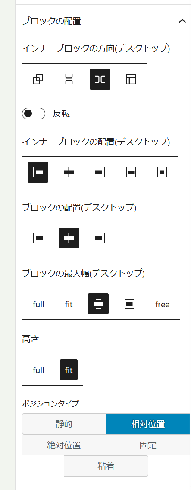

# 概要
WordPressのカスタムブロックを作成するためのプラグインで活用するパッケージです。複数のプラグインで共通に使用する機能をパッケージにまとめました。

# 使用方法
```
import {関数名又はコンポーネント名} from "itmar-block-packages"
```
名前付きインポートでお願いします。

# 各コンポーネント・関数の機能
## カスタムフック
### useIsIframeMobile
WordPressのエディタ（ブロックエディタ、サイトエディタ）の大きさを監視し、幅が767ピクセル以下であればtrueを返します。
```
const is_mobile=useIsIframeMobile();
```

### useElementBackgroundColor
ブロックの背景色を返します。ユーザー設定で指定されていれば、その色を返し、指定されていないか、カスタムプロパティ（--wpで始まるプロパティ）であれば、getComputedStyleで実際にレンダリングされた色を取得します。
#### 引数
- `blockRef`  
ブロックへの参照。useRefで取得
- `style`  
ブロックに設定されているスタイル。useBlockPropsで取得
```
//ブロックの参照
const blockRef = useRef(null);
//blockPropsの参照
const blockProps = useBlockProps({
	ref: blockRef, // ここで参照を blockProps に渡しています
});

//背景色の取得
const baseColor = useElementBackgroundColor(blockRef, blockProps.style);
```

### useElementWidth

### useIsMobile
ViewPortの大きさの大きさを監視し、幅が767ピクセル以下であればtrueを返します。
```
const is_mobile=useIsMobile();
```
### useDeepCompareEffect
たくさんの要素をもつオブジェクトや配列の内容の変化で発火するuseEffect
#### 引数
- `callback` func  
発火させたい関数
- `dependencies` array  
依存変数にしたい配列
```
useDeepCompareEffect(() => {
・・・
},
[attributes]

```
### useFontawesomeIframe
iframeにfontawesomeを読み込むカスタムフック

## styled-componet用のcssプロパティ生成関数
styled-componetのcssヘルパー関数内で使用するcssのパラメーターやプロパティを返します。
### radius_prm
border-radiusに設定するプロパティを文字列で返します。
#### 引数
- `radius` object  
topLeft,topRight,bottomRight,bottomLeftをキーとしてもつオブジェクト
  

### space_prm
marginやpaddingに設定するプロパティを文字列で返します。
#### 引数
- `space` object  
top,right,bottom,leftをキーとしてもつオブジェクト
  

### max_width_prm
最大幅を設定するためのCSSを返します。
#### 引数
- `width` string  
wideSize,contentSize,free,fullの文字列
- `free_val` number  
px値
#### 戻り値
- wideSizeのとき`width: 100%; max-width: var(--wp--style--global--wide-size);`  
- contentSizeのとき`width: 100%; max-width: var(--wp--style--global--content-size);`  
- freeのとき`width: 100%; max-width: ${free_val}px;`  
- fullのとき`width: 100%; max-width: 100%;`  
- その他の文字列`width: fit-content;`  
  

### width_prm
widthのCSSを返します。
#### 引数
- `width` string  
wideSize,contentSize,freeの文字列
- `free_val` number  
px値
#### 戻り値
- wideSizeのとき`width: var(--wp--style--global--wide-size);`
- contentSizeのとき`width: var(--wp--style--global--content-size);`
- freeのとき`width: ${free_val}px;`
- その他の文字列`width: fit-content;`
  

### height_prm
heightのCSSを返します。
#### 引数
- `height` string  
fitの文字列
#### 戻り値
- fitのとき`height: fit-content;`
- その他の文字列`height: 100%;`
  

### align_prm
marginによる横方向の配置のためのCSSを返します。
#### 引数
- `align` string  
center,rightの文字列
#### 戻り値
- centerのとき`margin-left: auto; margin-right: auto;`
- rightのとき`margin-left: auto; margin-right: 0`
- その他の文字列`margin-right: auto; margin-left: 0`
  

### convertToScss
キャメルケースで与えられたstyleオブジェクトをscssの文字列に変換します。
#### 引数
- `styleObject` object  
ブロックに設定されたスタイルオブジェクト

```
const str_scss = convertToScss(styleObject)
```
  

### borderProperty
WordPressのBorderBoxControlコンポーネントが返すオブジェクトをキャメルケースのCSSに変換して返します。
#### 引数
- `borderObj` object  
WordPressのBorderBoxControlコンポーネントが返すオブジェクト

```
const css_obj = borderProperty(borderObj)
```
  

### radiusProperty
WordPressのBorderRadiusControlコンポーネントが返すオブジェクトをキャメルケースのCSSに変換して返します。
#### 引数
- `radiusObj` object  
WordPressのBorderRadiusControlコンポーネントが返すオブジェクト

```
const css_obj = radiusProperty(radiusObj)
```
   

### marginProperty
marginのcssを返します。
#### 引数
- `marginObj` object  
top,right,bottom,leftをキーとしてもつオブジェクト。オブジェクトの値は単位（px,em,%等）付きにしてください。
  

### paddingProperty
paddingのcssを返します。
#### 引数
- `paddingObj` object  
top,right,bottom,leftをキーとしてもつオブジェクト。オブジェクトの値は単位（px,em,%等）付きにしてください。
  

## ボックスシャドーを設定するコントロール
### ShadowStyle
WordPressのブロックエディタのサイドバーにbox-shadowを設定するためのコントロールを表示させるReactコンポーネント。
```
<ShadowStyle
	shadowStyle={{ ...shadow_element }}
	onChange={(newStyle, newState) => {
		setAttributes({ shadow_result: newStyle.style });
		setAttributes({ shadow_element: newState });
	}}
/>
```


  
  
### ShadowElm
設定されたbox-shadowをスタイルオブジェクトとして返します。
#### 引数
- `shadowState` object  
ShadowStyleコンポーネントで生成され、ブロックの属性としてセットされるオブジェクト
  

## 疑似要素を設定するコントロール
### PseudoElm
WordPressのブロックエディタのサイドバーに疑似要素を設定するためのコントロールを表示させるReactコンポーネント。現時点のバージョンでは上下左右の矢印表示の設定のみが可能です。
```
<PseudoElm
	element="Arrow"
	direction={pseudoInfo.option}
	onChange={(direction) => {
		setAttributes({
			pseudoInfo: { ...pseudoInfo, option: direction },
		});
	}}
/>
```


### Arrow
矢印を表示させる疑似要素を生成してscssの文字列で返します。
```
const arrow = Arrow(direction);

```
#### 引数
- `direction` object  
キーをdirection、値をupper,left,right,underのいずれかとするオブジェクト
  


## メディアライブラリから画像を選択するコントロール
### SingleImageSelect
メディアライブラリ選択画面を開き、ブロックの属性にmediaとmedia.idをセットします。
```
<SingleImageSelect
	attributes={attributes}
	onSelectChange={(media) => {
		setAttributes({ media: media, mediaID: media.id });
	}}
/>
```
### MultiImageSelect
メディアライブラリ選択画面を開き、複数の画像を選択して、ブロックの属性にmediaとmedia.idをセットします。
```
<MultiImageSelect
	attributes={attributes}
	label=__("Selected Images", "text-domain")
	onSelectChange={(media) => {
		// media から map で id プロパティの配列を生成
		const media_ID = media.map((image) => image.id);
		setAttributes({
			mobile_val: { ...mobile_val, mediaID: media_ID, media: media },
		});
		
	}}
	onAllDelete={() => {
		setAttributes({
			mobile_val: { ...mobile_val, mediaID: [], media: [] },
		});
	}}
/>
```
  
  
## ブロックのドラッガブルを設定するコントロール
### DraggableBox
ブロックを移動させる移動量を設定するコントロールをサイドバーに表示させます。
```
<DraggableBox
	attributes={position}
	onPositionChange={(position) =>
		setAttributes({ position: position })
	}
/>
```
  

### useDraggingMove
参照したブロックを可能とするためのカスタムフックを設定します。
```
useDraggingMove(
  isMovable,
  blockRef,
  position,
  onPositionChange
)
```
#### 引数
- `isMovable` boolean
移動を可とするかどうかのフラグ
- `blockRef` useRef  
移動させるブロックへの参照
- `position` object  
移動量を決定するためのx,yのキーをもつオブジェクト
- `onPositionChange` function
移動量が変化したときに属性値を記録するためのコールバック関数
  

## ブロックをlazy Loadさせるためのラッパーモジュール
## BlockEditWrapper
registerBlockTypeの第２引数内にあるeditオブジェクトに、以下の使用例で生成したBlockEditを渡してやることで、ブロックの読み込みをレンダリングの時まで遅らせます。

```
const LazyEditComponent = React.lazy(() => import("./edit"));
const BlockEdit = (props) => {
	return <BlockEditWrapper lazyComponent={LazyEditComponent} {...props} />;
};
```
## ブロックにアニメーション効果をあたえるためのコントロール
### AnimationBlock
WordPressのブロックエディタのサイドバーにアニメーションを設定するためのコントロールを表示させるReactコンポーネント。現時点のバージョンではflipDown,fadeUp,fadeLeft,fadeRightのアニメーション設定が可能です
```
<AnimationBlock
	attributes={attributes}
	onChange={(newValue) => setAttributes(newValue)}
/>
```


### anime_comp
設定されたアニメーションのパラメータをオブジェクトとして渡すことで、SCSSの文字列に変換して返します。
#### 引数
- `anime_prm` object  
AnimationBlockコンポーネントで生成され、ブロックの属性としてセットされるオブジェクト
  

## Typographyを設定するコントロール
### TypographyControls
WordPressのブロックエディタのサイドバーにTypographyを設定するためのコントロールを表示させるReactコンポーネント。
```
<TypographyControls
	title={__("Typography", "text-domain")}
	fontStyle=	
	{
		default_fontSize: "16px",
		mobile_fontSize: "12px",
		fontFamily: "Arial, sans-serif",
		fontWeight: "500",
		isItalic: false,
	}
	initialOpen={false}
	isMobile={isMobile}
	onChange={(newStyle) => {
		setAttributes({ font_style_input: newStyle });
	}}
/>
```


## WordPressのデータをRest APIを通して取得する関数等
### fetchPagesOptions
固定ページのid,title,linkを返します。
### fetchArchiveOptions
投稿タイプのアーカイブのurlを返します。
### PageSelectControl
固定ページのタイトルを表示し、そのリンクを返すセレクトコントロールを表示させます。
```
<PageSelectControl
	attributes={attributes}
	setAttributes={setAttributes}
	label={__("Select a fixed page to link to", "text-domain")}
	homeUrl={block_collections.home_url}
/>
```
### ArchiveSelectControl
投稿タイプ名を表示し、そのアーカイブのURLを返すセレクトコントロールを表示させます。
```
<ArchiveSelectControl
	attributes={attributes}
	setAttributes={setAttributes}
	label={__("Select archive page to link to", "text-domain")}
	homeUrl={block_collections.home_url}
/>
```

## Font awesom のアイコンを選択するためのコントロール
### IconSelectControl
WordPressのブロックエディタのサイドバーにFont awesomのアイコンを選択するためのコントロールを表示させるReactコンポーネント。
```
<IconSelectControl
	iconStyle={
		icon_name: "f030",
		icon_pos: "left",
		icon_size: "24px",
		icon_color: "var(--wp--preset--color--content)",
		icon_space: "5px",
	}
	onChange={(newValue) => {
		setAttributes({icon_style: newValue})
	}}
/>
```


## DOM要素をラップしてレンダリングを変化させるReactコンポーネント
### ToggleElement
DOM要素をdiv要素でラップし、flgの値によって、その要素にopenというクラス名を付加します。呼び出し側でflgの値を変更することで、DOM要素の表示・非表示を操作するときに使用します。

```
<ToggleElement
	onToggle={handleHambergerToggle}
	className="itmar_hamberger_btn"
	openFlg={flg}
>
	<span></span>
	<span></span>
	<span></span>
</ToggleElement>
```

## グリッドスタイルの各種設定を行うためのコントロール
### GridControls
CSSでdisplay : grid が設定されたブロックに対し、gridの各種設定を行うため、モーダルウインドウを表示させるReactコンポーネント。
```
<GridControls
	attributes={props.grid_info}
	clientId={clientId}
	onChange={(newValue) => {
		props.onGridChange(newValue)
	}}
/>
```


## ブロックの配置に関する各種設定を行うためのコントロール
### BlockPlace
WordPressのブロックエディタのサイドバーにブロックの配置に関する設定のためのコントロールを表示させるReactコンポーネント。
```
<BlockPlace
	attributes={attributes}
	clientId={clientId}
	blockRef={blockRef}
	isMobile={isMobile}
	isSubmenu={is_submenu}
	onDirectionChange={(position) => {
		setAttributes({direction: position });
	}}
	onFlexChange={(position) => {
		setAttributes({inner_align: position });
	}}
	onAlignChange={(position) => {
		setAttributes({outer_align: position });
	}}
	onVerticalChange={(position) => {
		setAttributes({outer_vertical: position });
	}}
	onWidthChange={(position) => {
		setAttributes({outer_vertical: position });
	}}
	onHeightChange={(value) => {
		setAttributes({ heightValue: value });
	}}
	onFreevalChange={(value) => {
		setAttributes({free_val: position });
	}}
	onGridChange={(value) => {
		setAttributes({grid_info: position });
	}}
	onPositionChange={(value) => {
		setAttributes({ positionType: value });
	}}
	onPosValueChange={(value) => {
		setAttributes({posValue: position });
	}}
/>
```




## 色コードを変換する関数
### hslToRgb16
Hslオブジェクトの値を与えると#000000型のRGB表記に変換するためのユーティリティ関数です。
#### 引数
- `hue` number  
Hslオブジェクトのhueの値
- `saturation` number  
Hslオブジェクトのsaturationの値
- `lightness` number  
Hslオブジェクトのlightnessの値

### rgb16ToHsl
16進数のRGB表記を受け取り、それをHslオブジェクトに変換するためのユーティリティ関数です。
#### 引数
- `strRgb16` string  
#000000形式の１６進数の文字列又はrgb(0,0,0) 形式の文字列
　　

### HexToRGB
16進数のRGB表記を受け取り、それを10進数のRGBオブジェクトに変換するためのユーティリティ関数です。
#### 引数
- `strRgb16` string  
#000000形式の１６進数の文字列又はrgb(0,0,0) 形式の文字列